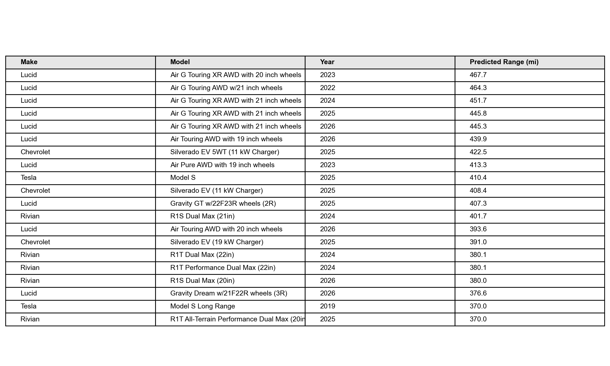
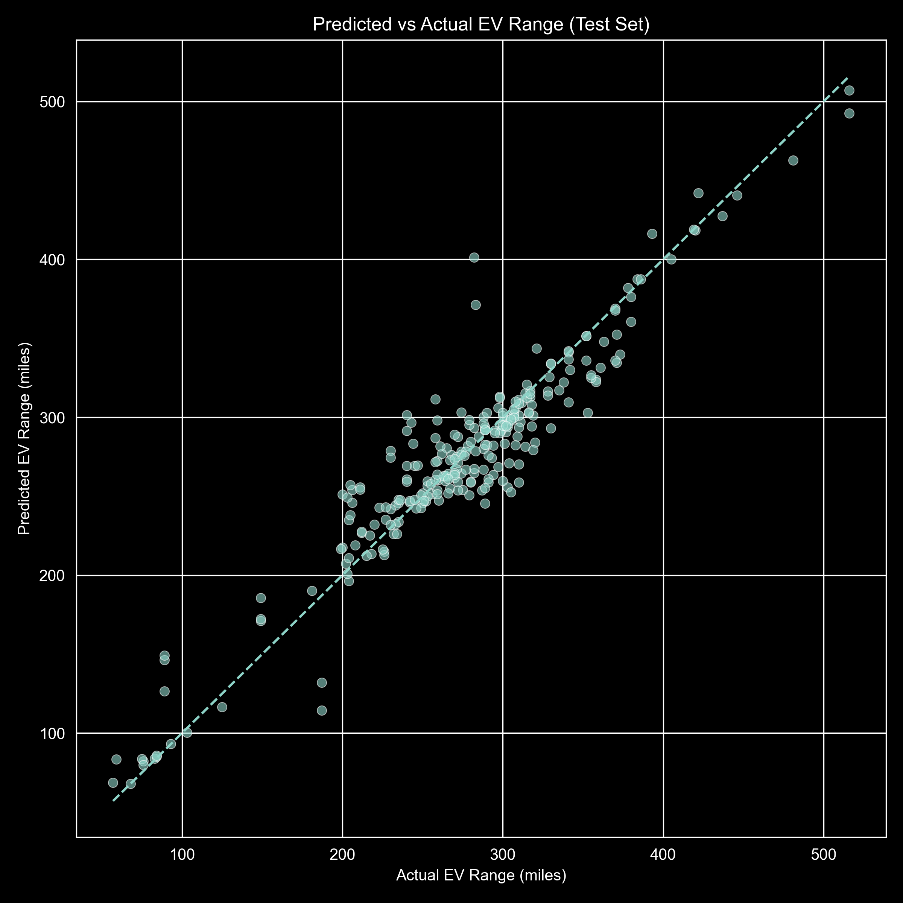

# EV Range Prediction 🚗⚡

An **end-to-end, leakage-aware machine learning pipeline** that predicts **EPA driving range (miles)** for electric vehicles using vehicle specifications and attributes.

This project emphasizes **real-world ML practices**: reproducibility, pipeline integrity, evaluation discipline, and interpretable insights — not just raw accuracy.

---

## 🎯 Project Objective

- Predict EV driving range (miles)
- Build a reusable preprocessing + model pipeline
- Support production-ready inference via script
- Generate interpretable insights and rankings
- Explicitly prevent feature leakage

---

## 📊 Dataset

- Source: **EPA Vehicles Dataset**
- Contains numeric, categorical, and efficiency-related features
- Includes many **post-processed attributes derived from energy consumption**

⚠️ Because many features can indirectly encode driving range, **leakage control was a primary design concern**.

---

## 🧠 Modeling Approach

- **Pipeline-based design** (`scikit-learn`)
- Preprocessing:
  - Numeric → median imputation
  - Categorical → constant imputation + one-hot encoding
- Model:
  - `RandomForestRegressor`
- Evaluation metrics:
  - MAE
  - RMSE
  - R²

---

## ⚠️ Design Decision: Notebook-Based Training

Model training is intentionally performed in notebooks rather than a standalone training script.

**Why this matters**

The EPA dataset contains multiple efficiency- and cost-derived features that can indirectly encode EV range. Notebook-based training enables:

- Explicit feature inspection
- Manual leakage detection
- Error analysis across brands and model years

This prevents misleadingly optimistic results that can occur in blind script-based retraining.

📌 **Authoritative training notebook:**
```
notebooks/02_model_training.ipynb
```

The `train.py` script exists to document this design choice and preserve reproducibility intent.

---

## 🔮 Inference (Production-Ready)

Predictions are generated using:

```bash
python predict.py
```

- Loads the full saved pipeline (`models/ev_range_model.joblib`)
- Applies preprocessing automatically
- Outputs predicted EV range (miles)

An example input/output pair is saved to:
```
data/processed/example_prediction.json
```

---

## 🏆 Insight: Top EVs by Predicted Range

Vehicles were ranked by **predicted EPA driving range** using the trained pipeline.

**Key result:**  
**Lucid Air Grand Touring variants consistently rank highest**, reflecting industry-leading efficiency and large battery capacity.

📄 Ranked results:
```
data/processed/top_ev_by_predicted_range.csv
```

📊 Visualization:

## Top 20 EVs by Predicted Driving Range

The model was used to generate predictions across the full dataset and rank vehicles by estimated driving range.

### Bar Chart — Relative Comparison
This visualization highlights how the top vehicles compare at a glance.


### Ranked Table — Exact Values
This table shows the exact ranked results used to generate the chart.



> **Note:** These rankings reflect model predictions based on historical EPA vehicle data and available features.  
> Results are influenced by feature availability, preprocessing choices, and model assumptions, and should not be interpreted as official EPA range ratings.





### Caveats
- Rankings are **model-based predictions**, not official EPA certification values
- Results reflect **driving range only**, not price, performance, or overall quality
- Analysis is limited to vehicles present in the **test subset**
- Intended for **comparative insight**, not consumer purchasing advice

---

## 📁 Project Structure

```
ev-range-prediction/
│
├── data/
│   ├── raw/
│   └── processed/
│
├── figures/
│   └── top_20_ev_by_predicted_range.png
│
├── models/
│   └── ev_range_model.joblib
│
├── notebooks/
│   ├── 01_data_overview.ipynb
│   ├── 02_model_training.ipynb
│   ├── 03_error_analysis_and_visualization.ipynb
│   ├── 04_interpretation.ipynb
│   └── 05_production_ready_pipeline.ipynb
│
├── predict.py
├── train.py
└── README.md
```

---

## ✅ Summary

This project demonstrates:

- End-to-end ML pipeline design
- Leakage-aware training decisions
- Honest evaluation and interpretation
- Production-ready inference
- Data-driven insight generation

The workflow reflects **real-world ML practice**, not benchmark-only optimization.
