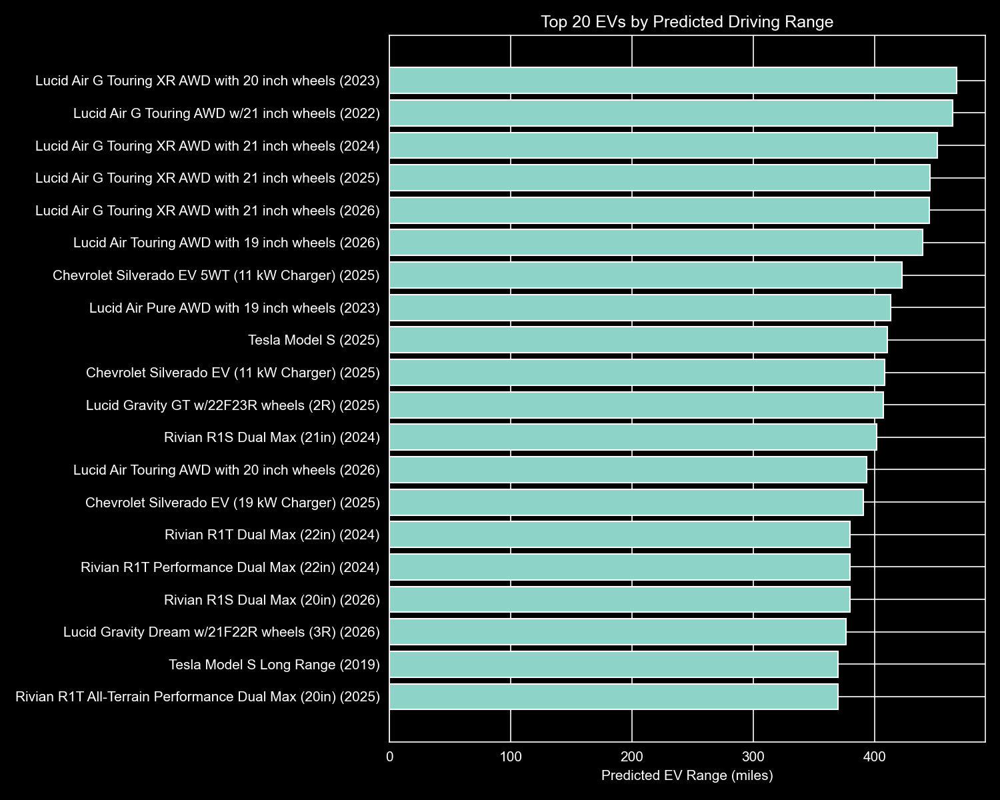

# EV Range Prediction 🚗⚡

This project builds a **production-ready machine learning pipeline** to predict the **EPA driving range (miles)** of electric vehicles using vehicle specifications and attributes.

The goal is not only to achieve strong predictive performance, but to demonstrate **sound ML practices**, including leakage awareness, reproducibility, and clear separation between research and inference.

---

## 🎯 Project Objective

- Predict EV driving range (miles)
- Build a reusable preprocessing + model pipeline
- Provide script-based inference (`predict.py`)
- Generate interpretable insights and visualizations
- Maintain honest evaluation and leakage control

---

## 📊 Dataset

- Source: EPA Vehicles Dataset
- Contains technical, categorical, and efficiency-related attributes
- Includes many **post-processed features** derived from energy consumption

⚠️ Because the dataset’s structure can encode the target indirectly, special care was taken to avoid **target leakage**.

---

## 🧠 Modeling Approach

- **Pipeline-based design** using `scikit-learn`
- Preprocessing:
  - Numeric features → median imputation
  - Categorical features → constant imputation + one-hot encoding
- Model:
  - `RandomForestRegressor`
- Evaluation metrics:
  - MAE
  - RMSE
  - R²

---

## ⚠️ Important Design Decision: Notebook-Based Training

Model training is intentionally performed in notebooks rather than a standalone training script.

**Why?**

The EPA dataset contains many efficiency- and cost-derived features that can indirectly encode driving range. Training inside notebooks allows:

- Explicit feature inspection
- Manual leakage detection
- Error analysis across brands and model years

This prevents misleadingly optimistic results that can occur in blind script-based retraining.

📌 **Authoritative training notebook:**
```
notebooks/02_model_training.ipynb
```

The `train.py` script exists to document this design choice and guide reproducibility.

---

## 🔮 Inference (Production-Ready)

Predictions are generated via:

```bash
python predict.py
```

- Loads the full saved pipeline (`models/ev_range_model.joblib`)
- Applies preprocessing automatically
- Outputs a predicted EV range in miles

An example input/output pair is saved to:
```
data/processed/example_prediction.json
```

---

## 🏆 Insight: Top EVs by Predicted Range

Using the trained model, vehicles were ranked by **predicted EPA driving range**.

### Key result:
**Lucid Air Grand Touring variants consistently rank highest**, reflecting their industry-leading efficiency and large battery capacity.

📄 Ranked results:
```
data/processed/top_ev_by_predicted_range.csv
```

📊 Visualization:



### Caveats:
- Rankings are based on **model predictions**, not official EPA certification values
- Results reflect **range only**, not price, performance, or overall vehicle quality
- Rankings are limited to vehicles present in the **test subset** of the dataset
- Intended for **comparative insight**, not consumer purchasing advice

---

## 📁 Project Structure

```
ev-range-prediction/
│
├── data/
│   ├── raw/
│   └── processed/
│
├── figures/
│   └── top_20_ev_by_predicted_range.png
│
├── models/
│   └── ev_range_model.joblib
│
├── notebooks/
│   ├── 01_data_overview.ipynb
│   ├── 02_model_training.ipynb
│   ├── 03_error_analysis_and_visualization.ipynb
│   ├── 04_interpretation.ipynb
│   └── 05_production_ready_pipeline.ipynb
│
├── predict.py
├── train.py
└── README.md
```

---

## ✅ Summary

This project demonstrates:
- End-to-end ML pipeline design
- Leakage-aware training
- Honest evaluation
- Reproducible inference
- Data-driven insight generation

It is designed to reflect **real-world ML workflows**, not just benchmark optimization.
